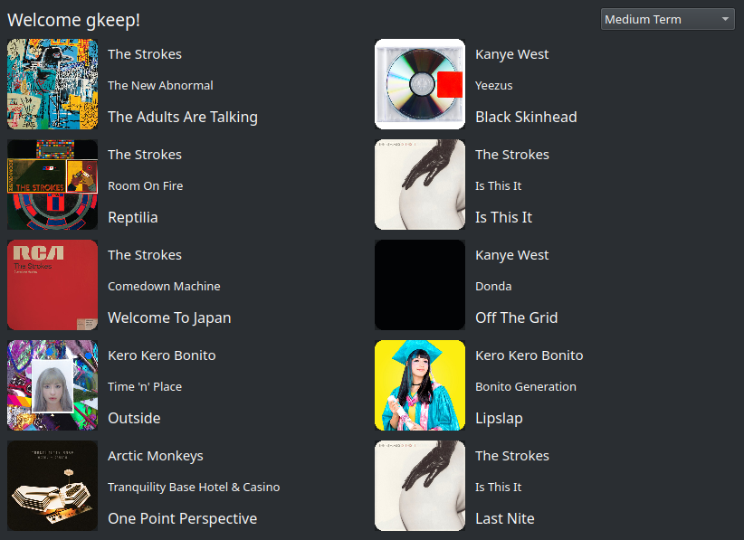

# spotify-stats

Spotify-stats is a small program made to display your top 10 tracks and artists from last 4 weeks (*short term*), last 6 months (*medium term*) and all time (*long term*).

**Libraries used**:

1. PyQt5
2. [Spotipy](https://spotipy.readthedocs.io/) - Python library for the Spotify Web API

## Data locations

- Config location: `$HOME/.config/spotify-stats/config`
- Cache location: `$HOME/.cache/spotify-stats`
- Logs location: `$HOME/.cache/spotify-stats/log/spotify-stats.log`

## For developers

### Pre-requirements

Generate Client ID and Client Secret for your account:

1. Open [Spotify for Developers Dashboard](https://developer.spotify.com/dashboard)
2. Create a new app
3. Set callback URIs: default config uses `http://localhost:9090/callback`
4. Set Client ID and Client Secret (and callback URI, if you changed that) from the Developer Dashboard page to config file (`config.sample` or `$HOME/.config/spotify-stats/config`)

It is recommended to set up [pyenv](https://github.com/pyenv/pyenv) and virtualenv.

1. Install Python >= 3.6 using *pyenv*: `pyenv install 3.7.0`
2. Select installed version of Python in the repository folder: `pyenv local 3.7.0`

### Development

1. Install virtualenv and create new venv for the repository: `$(pyenv which python) -m pip install virtualenv`, `$(pyenv which python) -m virtualenv venv`
2. Activate virtualenv and install dependencies: `. venv/bin/activate`, `pip install -r requirements.txt`

- Install default config with `make install-cfg`
- Run the app with `python src/main.py config.sample`
- Build the app with `make build`
- Run the built binary with `make run`

## LICENSE

MIT license. See [LICENSE](LICENSE) for more information.
